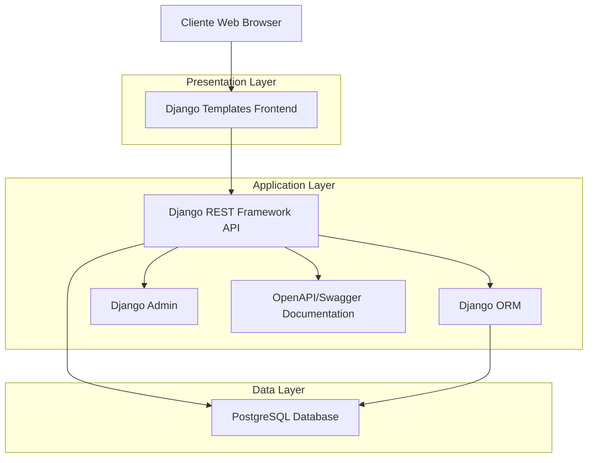
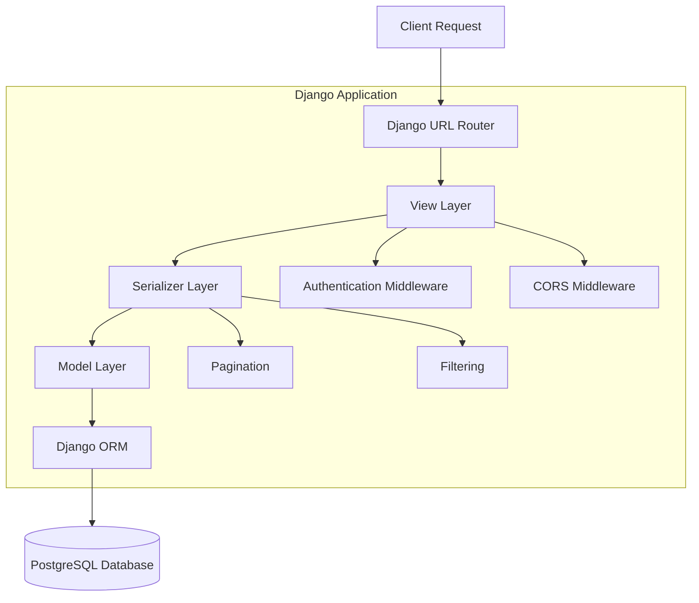
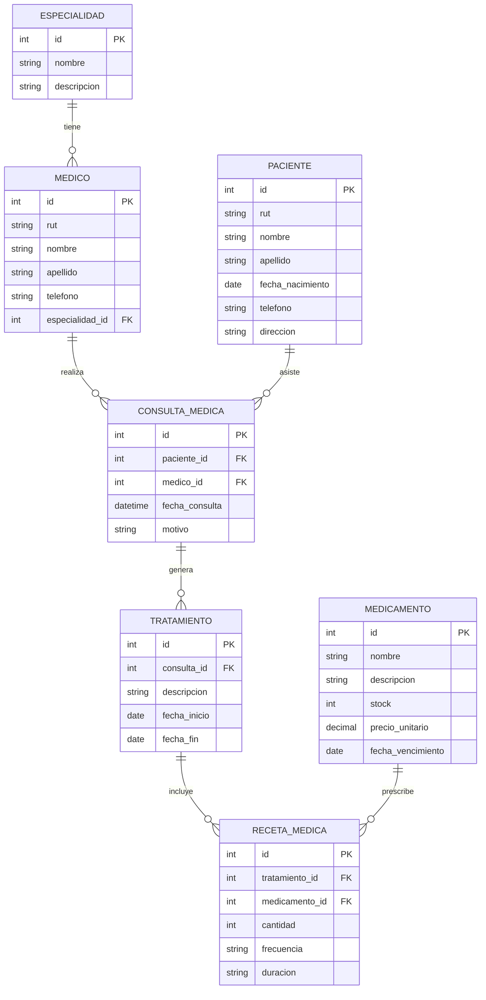

# Documento de Arquitectura Técnica - Sistema Salud Vital Ltda.

## 1. Architecture design



## 2. Technology Description

- **Backend**: Django@4.2 + Django REST Framework@3.14 + PostgreSQL
- **Frontend**: Django Templates + Bootstrap@5.3 + JavaScript
- **Documentation**: OpenAPI/Swagger + drf-spectacular
- **Environment**: Python@3.11 + Virtual Environment (eva2)
- **Database**: PostgreSQL@15 (password: 1983)

## 3. Route definitions

| Route | Purpose |
|-------|---------|
| / | Dashboard principal con estadísticas y accesos rápidos |
| /especialidades/ | Gestión CRUD de especialidades médicas |
| /medicos/ | Gestión CRUD de médicos con filtros por especialidad |
| /pacientes/ | Gestión CRUD de pacientes con búsqueda |
| /consultas/ | Gestión de consultas médicas con filtros |
| /tratamientos/ | Gestión de tratamientos asociados a consultas |
| /medicamentos/ | Inventario de medicamentos con control de stock |
| /recetas/ | Gestión de recetas médicas y prescripciones |
| /api/ | Endpoints de la API REST |
| /api/docs/ | Documentación OpenAPI/Swagger |
| /admin/ | Panel de administración Django |

## 4. API definitions

### 4.1 Core API

**Especialidades**
```
GET /api/especialidades/
POST /api/especialidades/
GET /api/especialidades/{id}/
PUT /api/especialidades/{id}/
DELETE /api/especialidades/{id}/
```

Request (POST/PUT):
| Param Name | Param Type | isRequired | Description |
|------------|------------|------------|-------------|
| nombre | string | true | Nombre de la especialidad |
| descripcion | string | false | Descripción de la especialidad |

Response:
| Param Name | Param Type | Description |
|------------|------------|-------------|
| id | integer | ID único de la especialidad |
| nombre | string | Nombre de la especialidad |
| descripcion | string | Descripción de la especialidad |

**Médicos**
```
GET /api/medicos/
POST /api/medicos/
GET /api/medicos/{id}/
PUT /api/medicos/{id}/
DELETE /api/medicos/{id}/
GET /api/medicos/?especialidad={especialidad_id}
```

Request (POST/PUT):
| Param Name | Param Type | isRequired | Description |
|------------|------------|------------|-------------|
| rut | string | true | RUT del médico |
| nombre | string | true | Nombre del médico |
| apellido | string | true | Apellido del médico |
| telefono | string | false | Teléfono de contacto |
| especialidad_id | integer | true | ID de la especialidad |

**Pacientes**
```
GET /api/pacientes/
POST /api/pacientes/
GET /api/pacientes/{id}/
PUT /api/pacientes/{id}/
DELETE /api/pacientes/{id}/
GET /api/pacientes/?search={query}
```

Request (POST/PUT):
| Param Name | Param Type | isRequired | Description |
|------------|------------|------------|-------------|
| rut | string | true | RUT del paciente |
| nombre | string | true | Nombre del paciente |
| apellido | string | true | Apellido del paciente |
| fecha_nacimiento | date | true | Fecha de nacimiento |
| telefono | string | false | Teléfono de contacto |
| direccion | string | false | Dirección del paciente |

**Consultas Médicas**
```
GET /api/consultas/
POST /api/consultas/
GET /api/consultas/{id}/
PUT /api/consultas/{id}/
DELETE /api/consultas/{id}/
GET /api/consultas/?medico={medico_id}&paciente={paciente_id}
```

**Tratamientos**
```
GET /api/tratamientos/
POST /api/tratamientos/
GET /api/tratamientos/{id}/
PUT /api/tratamientos/{id}/
DELETE /api/tratamientos/{id}/
GET /api/tratamientos/?consulta={consulta_id}
```

**Medicamentos**
```
GET /api/medicamentos/
POST /api/medicamentos/
GET /api/medicamentos/{id}/
PUT /api/medicamentos/{id}/
DELETE /api/medicamentos/{id}/
GET /api/medicamentos/?stock_bajo=true
```

**Recetas Médicas**
```
GET /api/recetas/
POST /api/recetas/
GET /api/recetas/{id}/
PUT /api/recetas/{id}/
DELETE /api/recetas/{id}/
GET /api/recetas/?tratamiento={tratamiento_id}
```

## 5. Server architecture diagram



## 6. Data model

### 6.1 Data model definition



### 6.2 Data Definition Language

**Tabla Especialidades**
```sql
-- Crear tabla especialidades
CREATE TABLE especialidades (
    id SERIAL PRIMARY KEY,
    nombre VARCHAR(100) NOT NULL UNIQUE,
    descripcion TEXT,
    created_at TIMESTAMP WITH TIME ZONE DEFAULT NOW(),
    updated_at TIMESTAMP WITH TIME ZONE DEFAULT NOW()
);

-- Datos iniciales
INSERT INTO especialidades (nombre, descripcion) VALUES
('Medicina General', 'Atención médica general y preventiva'),
('Cardiología', 'Especialidad en enfermedades del corazón'),
('Pediatría', 'Atención médica especializada en niños'),
('Ginecología', 'Especialidad en salud femenina'),
('Traumatología', 'Especialidad en lesiones y fracturas');
```

**Tabla Médicos**
```sql
-- Crear tabla médicos
CREATE TABLE medicos (
    id SERIAL PRIMARY KEY,
    rut VARCHAR(12) NOT NULL UNIQUE,
    nombre VARCHAR(50) NOT NULL,
    apellido VARCHAR(50) NOT NULL,
    telefono VARCHAR(15),
    especialidad_id INTEGER NOT NULL,
    created_at TIMESTAMP WITH TIME ZONE DEFAULT NOW(),
    updated_at TIMESTAMP WITH TIME ZONE DEFAULT NOW(),
    FOREIGN KEY (especialidad_id) REFERENCES especialidades(id)
);

-- Índices
CREATE INDEX idx_medicos_especialidad ON medicos(especialidad_id);
CREATE INDEX idx_medicos_rut ON medicos(rut);
```

**Tabla Pacientes**
```sql
-- Crear tabla pacientes
CREATE TABLE pacientes (
    id SERIAL PRIMARY KEY,
    rut VARCHAR(12) NOT NULL UNIQUE,
    nombre VARCHAR(50) NOT NULL,
    apellido VARCHAR(50) NOT NULL,
    fecha_nacimiento DATE NOT NULL,
    telefono VARCHAR(15),
    direccion TEXT,
    created_at TIMESTAMP WITH TIME ZONE DEFAULT NOW(),
    updated_at TIMESTAMP WITH TIME ZONE DEFAULT NOW()
);

-- Índices
CREATE INDEX idx_pacientes_rut ON pacientes(rut);
CREATE INDEX idx_pacientes_nombre ON pacientes(nombre, apellido);
```

**Tabla Consultas Médicas**
```sql
-- Crear tabla consultas médicas
CREATE TABLE consultas_medicas (
    id SERIAL PRIMARY KEY,
    paciente_id INTEGER NOT NULL,
    medico_id INTEGER NOT NULL,
    fecha_consulta TIMESTAMP WITH TIME ZONE NOT NULL,
    motivo TEXT NOT NULL,
    created_at TIMESTAMP WITH TIME ZONE DEFAULT NOW(),
    updated_at TIMESTAMP WITH TIME ZONE DEFAULT NOW(),
    FOREIGN KEY (paciente_id) REFERENCES pacientes(id),
    FOREIGN KEY (medico_id) REFERENCES medicos(id)
);

-- Índices
CREATE INDEX idx_consultas_paciente ON consultas_medicas(paciente_id);
CREATE INDEX idx_consultas_medico ON consultas_medicas(medico_id);
CREATE INDEX idx_consultas_fecha ON consultas_medicas(fecha_consulta);
```

**Tabla Tratamientos**
```sql
-- Crear tabla tratamientos
CREATE TABLE tratamientos (
    id SERIAL PRIMARY KEY,
    consulta_id INTEGER NOT NULL,
    descripcion TEXT NOT NULL,
    fecha_inicio DATE NOT NULL,
    fecha_fin DATE,
    created_at TIMESTAMP WITH TIME ZONE DEFAULT NOW(),
    updated_at TIMESTAMP WITH TIME ZONE DEFAULT NOW(),
    FOREIGN KEY (consulta_id) REFERENCES consultas_medicas(id)
);

-- Índices
CREATE INDEX idx_tratamientos_consulta ON tratamientos(consulta_id);
CREATE INDEX idx_tratamientos_fechas ON tratamientos(fecha_inicio, fecha_fin);
```

**Tabla Medicamentos**
```sql
-- Crear tabla medicamentos
CREATE TABLE medicamentos (
    id SERIAL PRIMARY KEY,
    nombre VARCHAR(100) NOT NULL,
    descripcion TEXT,
    stock INTEGER NOT NULL DEFAULT 0,
    precio_unitario DECIMAL(10,2) NOT NULL,
    fecha_vencimiento DATE NOT NULL,
    created_at TIMESTAMP WITH TIME ZONE DEFAULT NOW(),
    updated_at TIMESTAMP WITH TIME ZONE DEFAULT NOW()
);

-- Índices
CREATE INDEX idx_medicamentos_nombre ON medicamentos(nombre);
CREATE INDEX idx_medicamentos_vencimiento ON medicamentos(fecha_vencimiento);
CREATE INDEX idx_medicamentos_stock ON medicamentos(stock);

-- Datos iniciales
INSERT INTO medicamentos (nombre, descripcion, stock, precio_unitario, fecha_vencimiento) VALUES
('Paracetamol 500mg', 'Analgésico y antipirético', 100, 150.00, '2025-12-31'),
('Ibuprofeno 400mg', 'Antiinflamatorio no esteroideo', 80, 200.00, '2025-10-15'),
('Amoxicilina 500mg', 'Antibiótico de amplio espectro', 50, 350.00, '2025-08-20');
```

**Tabla Recetas Médicas**
```sql
-- Crear tabla recetas médicas
CREATE TABLE recetas_medicas (
    id SERIAL PRIMARY KEY,
    tratamiento_id INTEGER NOT NULL,
    medicamento_id INTEGER NOT NULL,
    cantidad INTEGER NOT NULL,
    frecuencia VARCHAR(50) NOT NULL,
    duracion VARCHAR(50) NOT NULL,
    created_at TIMESTAMP WITH TIME ZONE DEFAULT NOW(),
    updated_at TIMESTAMP WITH TIME ZONE DEFAULT NOW(),
    FOREIGN KEY (tratamiento_id) REFERENCES tratamientos(id),
    FOREIGN KEY (medicamento_id) REFERENCES medicamentos(id)
);

-- Índices
CREATE INDEX idx_recetas_tratamiento ON recetas_medicas(tratamiento_id);
CREATE INDEX idx_recetas_medicamento ON recetas_medicas(medicamento_id);
```