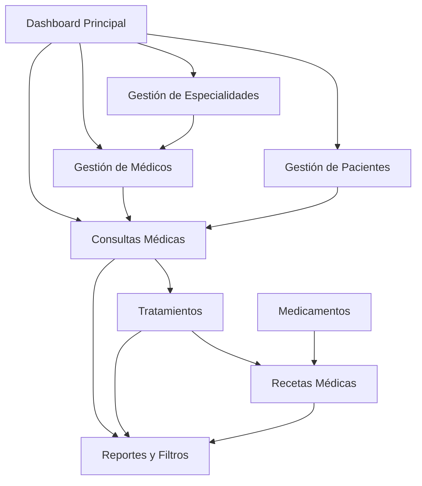

# Documento de Requerimientos del Producto - Sistema Salud Vital Ltda.

## 1. Product Overview

Sistema integral de administración médica para Salud Vital Ltda., una clínica de tamaño mediano que busca digitalizar completamente su gestión de pacientes, médicos y atenciones médicas.

El sistema permitirá registrar consultas, especialidades, tratamientos, recetas y medicamentos, generando reportes filtrados por médico, especialidad o paciente para optimizar la gestión clínica y mejorar la atención al paciente.

## 2. Core Features

### 2.1 User Roles

| Role | Registration Method | Core Permissions |
|------|---------------------|------------------|
| Administrador | Acceso directo del sistema | Gestión completa de todas las entidades, reportes y configuración |
| Personal Médico | Registro por administrador | Gestión de consultas, tratamientos y recetas de sus pacientes |
| Personal Administrativo | Registro por administrador | Gestión de pacientes, citas y consulta de información básica |

### 2.2 Feature Module

Nuestro sistema de administración médica consta de las siguientes páginas principales:

1. **Dashboard Principal**: panel de control, estadísticas generales, accesos rápidos
2. **Gestión de Especialidades**: listado de especialidades, crear/editar especialidades
3. **Gestión de Médicos**: registro de médicos, asignación de especialidades, información de contacto
4. **Gestión de Pacientes**: registro de pacientes, historial médico, información personal
5. **Consultas Médicas**: programación de consultas, registro de motivos, seguimiento
6. **Tratamientos**: creación de tratamientos, seguimiento de progreso, fechas de inicio/fin
7. **Medicamentos**: inventario de medicamentos, control de stock, fechas de vencimiento
8. **Recetas Médicas**: prescripción de medicamentos, dosificación, frecuencia y duración

### 2.3 Page Details

| Page Name | Module Name | Feature description |
|-----------|-------------|---------------------|
| Dashboard Principal | Panel de Control | Mostrar estadísticas de consultas diarias, pacientes activos, medicamentos por vencer |
| Dashboard Principal | Accesos Rápidos | Botones de acceso directo a funciones más utilizadas |
| Gestión de Especialidades | Lista de Especialidades | Crear, listar, actualizar y eliminar especialidades médicas |
| Gestión de Médicos | Registro de Médicos | Crear, listar, actualizar y eliminar médicos con asignación de especialidades |
| Gestión de Médicos | Filtros por Especialidad | Filtrar médicos por especialidad asignada |
| Gestión de Pacientes | Registro de Pacientes | Crear, listar, actualizar y eliminar pacientes con datos personales completos |
| Gestión de Pacientes | Búsqueda de Pacientes | Buscar pacientes por RUT, nombre o apellido |
| Consultas Médicas | Programación de Consultas | Crear, listar, actualizar consultas médicas con asignación de médico y paciente |
| Consultas Médicas | Filtros de Consultas | Filtrar consultas por médico, paciente o fecha |
| Tratamientos | Gestión de Tratamientos | Crear, listar, actualizar tratamientos asociados a consultas médicas |
| Tratamientos | Seguimiento de Tratamientos | Control de fechas de inicio, fin y progreso del tratamiento |
| Medicamentos | Inventario de Medicamentos | Crear, listar, actualizar medicamentos con control de stock y precios |
| Medicamentos | Control de Vencimientos | Alertas de medicamentos próximos a vencer |
| Recetas Médicas | Prescripción de Medicamentos | Crear recetas médicas con medicamentos, cantidad, frecuencia y duración |
| Recetas Médicas | Historial de Recetas | Consultar historial de recetas por paciente o tratamiento |

## 3. Core Process

**Flujo Principal del Sistema:**

1. **Registro de Especialidades**: El administrador registra las especialidades médicas disponibles
2. **Registro de Médicos**: Se registran los médicos asignándoles especialidades específicas
3. **Registro de Pacientes**: Se registran los pacientes con sus datos personales completos
4. **Programación de Consultas**: Se programan consultas asignando médico y paciente
5. **Registro de Tratamientos**: Durante o después de la consulta se registran los tratamientos necesarios
6. **Gestión de Medicamentos**: Se mantiene actualizado el inventario de medicamentos
7. **Prescripción de Recetas**: Se prescriben medicamentos específicos para cada tratamiento

## 4. User Interface Design

### 4.1 Design Style

- **Colores Primarios**: Azul médico (#2563eb), Verde salud (#16a34a)
- **Colores Secundarios**: Gris claro (#f8fafc), Blanco (#ffffff)
- **Estilo de Botones**: Redondeados con sombras suaves, efectos hover
- **Fuente**: Inter o Roboto, tamaños 14px-16px para texto, 18px-24px para títulos
- **Estilo de Layout**: Diseño basado en tarjetas con navegación lateral fija
- **Iconos**: Iconos médicos profesionales, estilo outline con relleno en estados activos

### 4.2 Page Design Overview

| Page Name | Module Name | UI Elements |
|-----------|-------------|-------------|
| Dashboard Principal | Panel de Control | Tarjetas con estadísticas, gráficos simples, colores azul y verde, iconos médicos |
| Gestión de Especialidades | Lista de Especialidades | Tabla responsiva, botones de acción azules, modal para crear/editar |
| Gestión de Médicos | Registro de Médicos | Formulario en dos columnas, dropdown para especialidades, validación en tiempo real |
| Gestión de Pacientes | Registro de Pacientes | Formulario estructurado, campos de fecha con datepicker, validación de RUT |
| Consultas Médicas | Programación | Calendario visual, formulario modal, selects con búsqueda para médico/paciente |
| Tratamientos | Gestión de Tratamientos | Timeline visual, tarjetas de progreso, indicadores de estado |
| Medicamentos | Inventario | Tabla con alertas de stock bajo, badges de estado, filtros avanzados |
| Recetas Médicas | Prescripción | Formulario paso a paso, selección múltiple de medicamentos, cálculo automático |

### 4.3 Responsiveness

El sistema está diseñado con enfoque desktop-first pero completamente adaptable a dispositivos móviles y tablets. Incluye optimización para interacción táctil en formularios y navegación, con menús colapsables y reorganización de contenido para pantallas pequeñas.